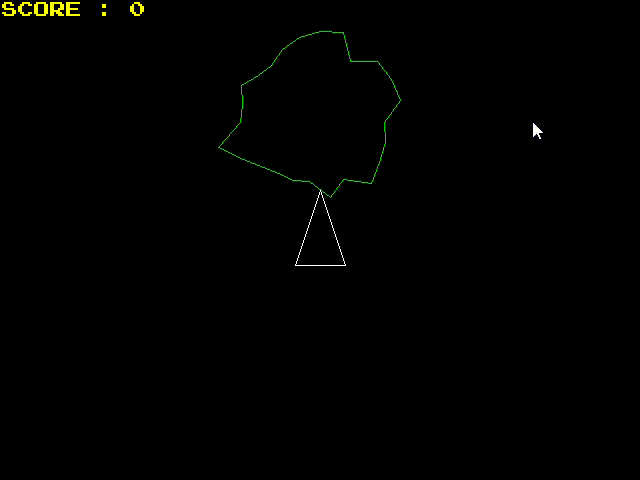
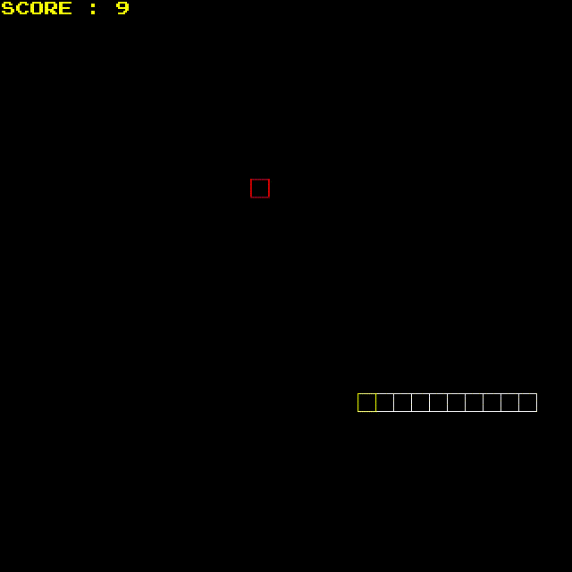

# CPPND: Capstone project ND Game Engine
  
# ND Game Engine : NanoDegree Game Engine  

## Create any 2D game using *ND Game Engine*


Prerequisites
--------------
* CMake 3.7 or later
* Windows
  * Environment variable `SDL2DIR` is set to extracted SDL2 development libraries directory e.g.
    `SDL2DIR=C:\Users\Public\Downloads\SDL2-2.0.16` 
  * Instructions: https://lazyfoo.net/tutorials/SDL/01_hello_SDL/windows/msvc2019/index.php
  
* Linux
  * SDL2 >= 2.0
  * All installation instructions can be found [here](https://wiki.libsdl.org/Installation)
  >Note that for Linux, an `apt` or `apt-get` installation is preferred to building from source. 


## Basic Build Instructions

1. Clone this repo.
2. Make a build directory in the top level directory: `mkdir build && cd build`
3. For Default Asteroids Game  
   3.1 Compile: `cmake .. && make`  
   3.2 Run it: `./AsteroidsGame`.  
4. For Snake Game  
   4.1 Compile: `cmake -DSNAKE=ON .. && make`  
   4.2 Run it: `./SnakeGame`.  

## Build Instructions on platforms
Windows 
--------------
* Default Game build is Asteroids Game. For Snake game provide option -DSNAKE

`cmake -G "Visual Studio 16 2019" -B.\build`  
`cmake --build .\build`  

* Build or build and install in single step
```
rmdir /q /s build & cmake -G "Visual Studio 16 2019" -B.\build && cmake --build .\build && cmake --install .\build --config Debug
```
* Run
  * build\install\AsteroidsGame.exe  

 
* Building Snake game in  single step 
```
rmdir /q /s build & cmake -G "Visual Studio 16 2019" -DSNAKE=ON -B.\build && cmake --build .\build && cmake --install .\build --config Debug
```
* Run
  * build\install\SnakeGame.exe

Linux
--------------
* Default Game build is Asteroids Game. For Snake game provide option -DSNAKE

`rm -rf build && cmake -Bbuild && cmake --build build`

* Build or build and install in single step
```
rm -rf build && cmake -Bbuild && cmake --build build && cmake --install build
```

* Build or build and install Snake Game in single step
```
rm -rf build && cmake -DSNAKE=ON -Bbuild && cmake --build build && cmake --install build
```

Example: 2D games built with NdGameEngine
------------------------------------------

   




## Rubric point addressed

* [Compiling and Testing](https://github.com/Vijay-C-Katoch/CppND-Capstone-NdGameEngine#basic-build-instructions)
* [Loops, Functions, I/O](https://github.com/Vijay-C-Katoch/CppND-Capstone-NdGameEngine/blob/3eca6eb3d1d85c57251509614eb2a4bf04ca11c2/src/nd_game_engine/ndGameEngine.cpp#L298)
* [Object Oriented Programming](https://github.com/Vijay-C-Katoch/CppND-Capstone-NdGameEngine/blob/3eca6eb3d1d85c57251509614eb2a4bf04ca11c2/src/nd_game_engine/mediaLibrary.h#L35)
* [Memory Management](https://github.com/Vijay-C-Katoch/CppND-Capstone-NdGameEngine/blob/3eca6eb3d1d85c57251509614eb2a4bf04ca11c2/src/nd_game_engine/ndGameEngine.cpp#L84)
* [Concurrency](https://github.com/Vijay-C-Katoch/CppND-Capstone-NdGameEngine/blob/3eca6eb3d1d85c57251509614eb2a4bf04ca11c2/src/nd_game_engine/ndGameEngine.cpp#L91)
  

# License
* https://github.com/Vijay-C-Katoch/CppND-Capstone-NdGameEngine/blob/main/LICENSE.md


